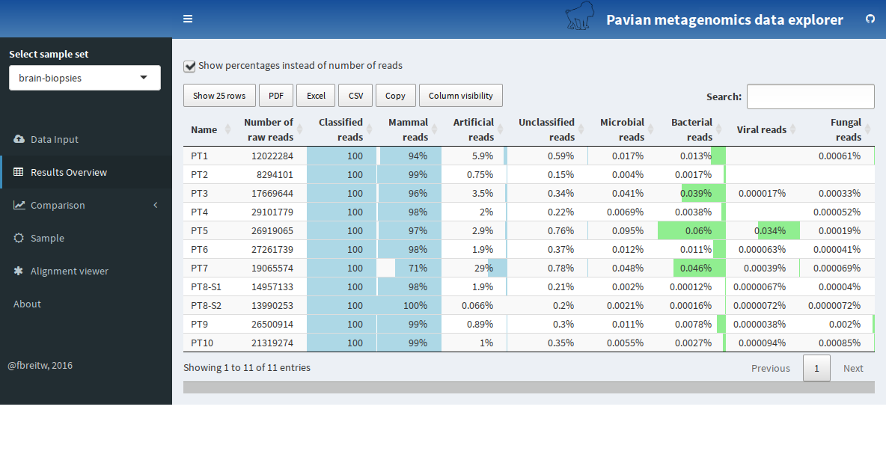
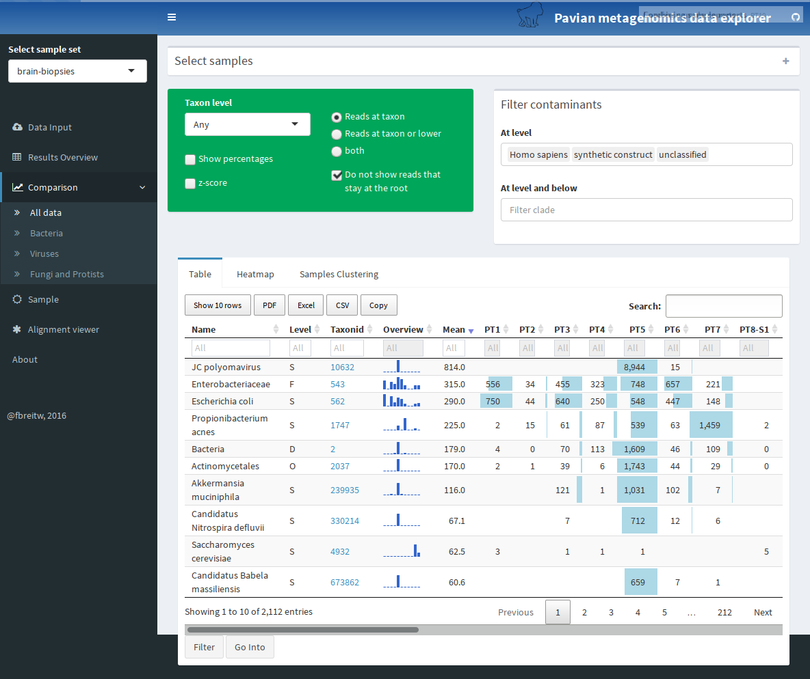
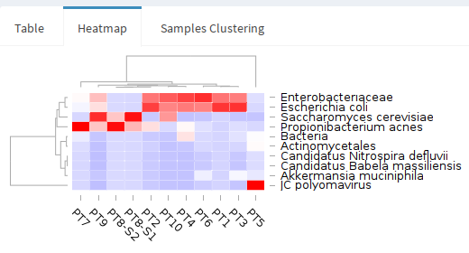

# General workflow

1) Import Kraken and Centrifuge report files (a sample set)
2) Look at the overall statistics across the samples
3) Compare the classification across samples
    - in specific domains
    - interactive table or heatmap
4) Zoom into one sample - flow chart or sunburst diagram
5) Zoom into one pathogen in one sample 
    - view the alignment on the genome

# Import Kraken and Centrifuge report files

The first step is loading data. Pavian expects files ending with '.report.csv', generated with kraken-report or centrifuge-report, resp. Click 'Choose files' to select files to upload to Pavian. The uploaded files will be added to a new sample set with an auto-generated name. You can change the name of the samples and the sample set using the interface that appears, once the files are loaded. 

In this walkthrough we use data from @SSalzberg_CPardo2016-NNN. To load this data, click the 'Load example data' button. This study sequenced brain or spinal cord biopsies from 10 patients with suspected central nervous system (CNS) infections. Upon loading the data, the links to 'Results Overview', 'Comparison' and 'Sample' become available in the sidebar, and a table describes the loaded sample set (see Figure 1).

## Brain biopsies data
@SSalzberg_CPardo2016-NNN used sequencing to detect the presence of pathogenic microbes in brain or spinal cord biopsies from 10 patients with neurologic problems indicating possible infection, but for whom conventional clinical and microbiology studies yielded negative or inconclusive results. Direct DNA and RNA sequencing of brain tissue biopsies generated 8.3 million to 29.1 million sequence reads per sample. 

Every samples is from a diseased patient. There are no healthy controls, and for all but one patient (PT8) there is only one sample available. The patients had different diseases; thus it was not expected that the same bug was the cause in the patients. The samples are their own control - ubiquitously present microbes were disregarded as sequencing or laboratory contaminants. Most of the reads in each sample are human, or from common contaminants - bacteria that always appear but are unlikely to cause the infection, such as P. acnes.

The FASTQ files for this study are available at http://www.ncbi.nlm.nih.gov/bioproject/PRJNA314149. The reads were classified with Kraken. The Kraken report files from these sampels are available at ADDLINK. 

# Look at the overall statistics across the samples

Select 'Results Overview' in the sidebar to load the report files. This will show a vire with the number of reads in the different samples, as well as the overall classification in different categories (see Figure 2). 

The samples of the brain biopsies dataset have between 8.3 and 29 million reads, most of them classified as 'mammal' (a 'mammal' is usually the host in these studies). There is a varying number of reads classifie as artificial - usually below 5%, but two outliers in sample PT1 and PT7 with 5.9 and 29%, respectively. The number of reads classified as microbial is below .1% in all samples.

# Compare the classification across samples

Click 'Comparison' and 'All data' to delve into the data (see Figure 3). The sample comparison view juxtaposes the identification results from the samples in a queryable table with taxa as rows and samples as columns. The table provides a visual guide to the values with inline bars, and the column taxid links to NCBI. You can decide to show percentages or z-scores, only show results at a certain taxon level, and filter uninteresting taxa. By default, the taxa 'Homo sapiens', 'synthetic construct' and 'unclassified' are filtered.

From this view, you can also select to see the data in the table in a heatmap representation (Figure 4). Note that the data displayed always correspond to the table - to show more rows in the heatmap, first select to show more rows in the table. Furthermore, you can look at how the samples are correlated with each other in 'Samples Clustering'.

In the brain biospies dataset, we immediately see an outlier in sample PT5, which is the only one with a substantial number of JC polyomavirus reads. Note the table is rather wide with ten samples, and the fourth column provides an overview of the values in all columns. You can restrict the view to bacteria, viruses, or eukaryotic microbes by selecting the appropriate link in the sidebar.

# Zoom into one sample - flow chart or sunburst diagram

As JC Polyomavirus is a prime suspect in sample PT5, let's look further into the sample. Select 'Sample' in the sidebar, and then 'PT5'. Apparent only JCV.

The sample comparison view allows a user to juxtapose the identification results from multiple samples (Figure 1C). The main view is an interactive table with taxa as rows and samples as columns. As the number of samples grows, this table can get very wide; thus to provide overview of the abundances in wide tables, the third column contains an inline barchart representation of the countsfor a given species (row) across all samples. By default, read counts at all taxonomy levels are shown, but it is possible to only show specific taxonomical levels. The table can be queried and filtered.

The same results may also be inspected with an interactive heatmap, shown in Figure 1D. The samples and microbes may be clustered to group together samples with similar microbial profiles. Clicking on a row or column focuses in on one sample and microbe.

# Zoom into one pathogen in one sample 

A high read count for a particular species does not always mean that the microbe is present. Sometimes, "bad" genomes or contaminant sequences produce spurious counts. This issue usually can be resolved by re-aligning the sequences to a single genome, and examining their distribution across the genome. For species that are truly present, reads should be rather uniformly distributed across the chromosomes. Pavian incorporates functions to a download single microbial genome, and view alignment results.

While the alignment viewer alone might not provide the full answer one the presence or absence of a microbe, it certainly helps filtering out spurious ones.

    - view the alignment on the genome

# References
