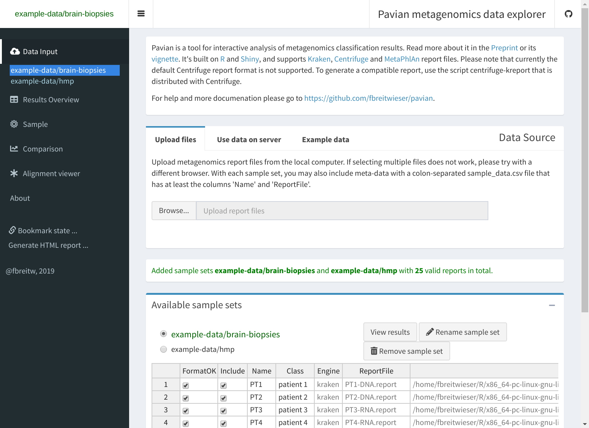
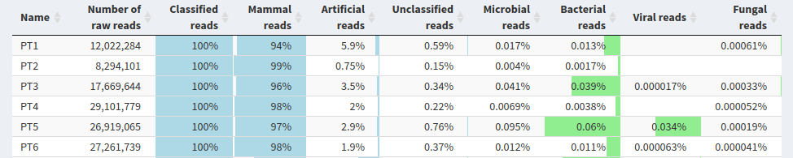
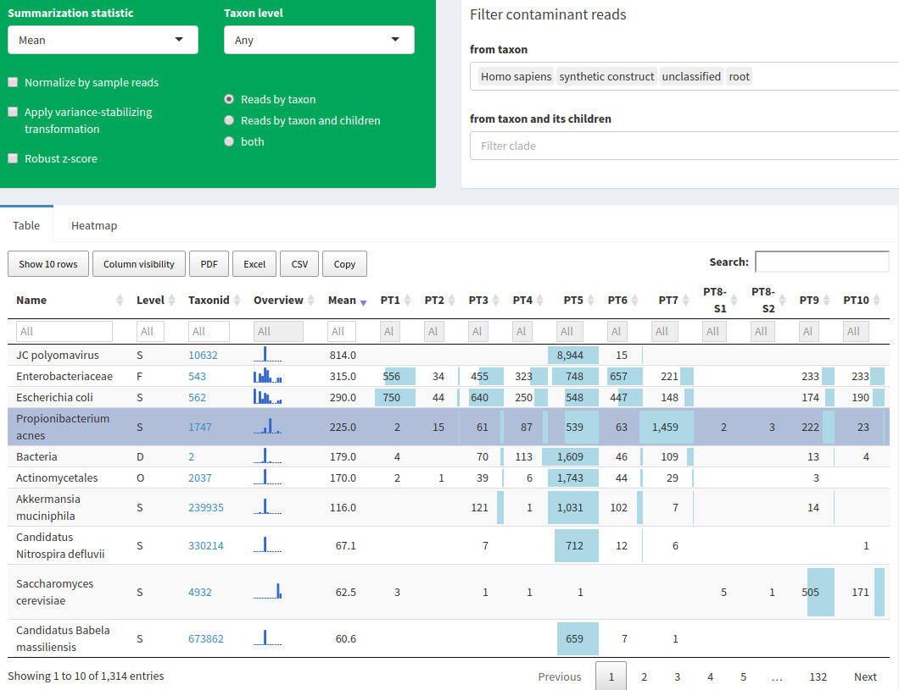
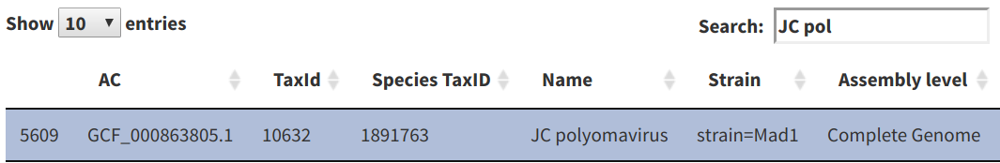
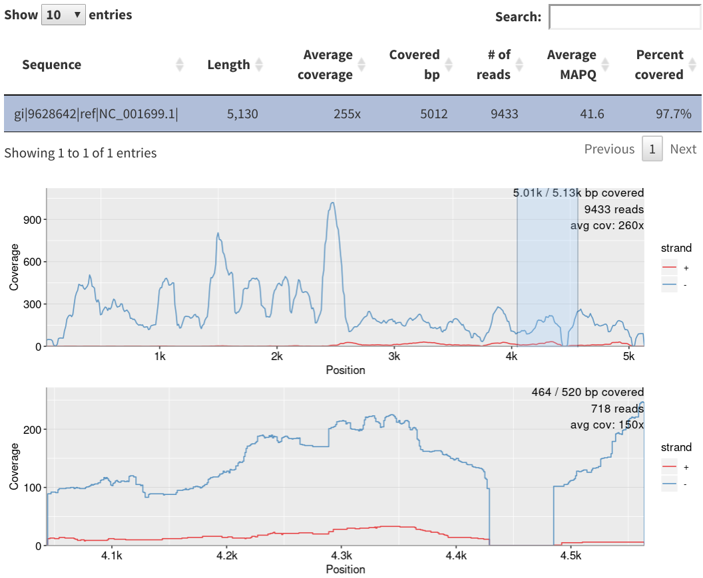

## Introduction

Pavian ('pathogen visualization and more') is a interactive web tool to explore at metagenomics classification results. Pavian has been developed with this clinical metagenomics in mind. However, it should be useful to anyone who wants to analyze and visualize their metagenomics data. This document gives a walkthrough of the interface by looking at the provided example data from brain biospies. The images have been generated using RSelenium.

## 1) Data Input - Import Kraken and Centrifuge report files
The first step is loading data. Pavian currently supports results from Kraken [@DWood_SSalzberg2014-GB] and Centrifuge [@DKim_SSalzber2016-Biorxiv]. It expects files ending with '.report.csv', generated with kraken-report or centrifuge-report. Before data is loaded, Pavian shows only a limited part of the interface (see Figure 1). Click 'Browse' or 'Choose files' (depending on browser) to select files to upload to Pavian. The uploaded files will be added to a new sample set with an auto-generated name. You can change the name of the samples and the sample set using the interface that appears, once the files are loaded. 

In this walk through we use data from @SSalzberg_CPardo2016-NNN. To load this data, click the 'Load example data' button. This study sequenced brain or spinal cord biopsies from 10 patients with suspected central nervous system (CNS) infections. Upon loading the data, the links to 'Results Overview', 'Comparison' and 'Sample' become available in the sidebar, and a table describes the loaded sample set (see Figure 1).

### Brain biopsies data
@SSalzberg_CPardo2016-NNN used sequencing to detect the presence of pathogenic microbes in brain or spinal cord biopsies from 10 patients with neurological problems indicating possible infection, but for whom conventional clinical and microbiology studies yielded negative or inconclusive results. Direct DNA and RNA sequencing of brain tissue biopsies generated 8.3 million to 29.1 million sequence reads per sample. 

Every samples is from a diseased patient. There are no healthy controls, and for all but one patient (PT8) there is only one sample available. The patients had different diseases; thus it was not expected that the same bug was the cause in the patients. The samples are their own control - ubiquitously present microbes probably are sequencing or laboratory contaminants. 

The FASTQ files for this study are available at http://www.ncbi.nlm.nih.gov/bioproject/PRJNA314149. The reads were classified with Kraken.

## 2) Results Overview - Look at the overall statistics across the samples

Select 'Results Overview' in the sidebar to load the report files. After the files are loaded, the number of reads in the different samples, as well as the overall classification in different categories are displayed in a table (see Figure 2). 

The samples of the brain biopsies dataset have between 8.3 and 29 million reads, most of them classified as 'mammal' (a 'mammal' is usually the host in these studies). There is a varying number of reads classified as artificial - usually below 5%, but two outliers in sample PT1 and PT7 with 5.9 and 29%, respectively. The number of reads classified as microbial is below .1% in all samples.

## 3) Comparision - Compare the classification across samples

Click 'Comparison' and 'All data' to delve into the data (see Figure 3). The sample comparison view juxtaposes the identification results from the samples in a query-able table with taxa as rows and samples as columns. The table provides a visual guide to the values with inline bars, and the column taxid links to NCBI. You can decide to show percentages or z-scores, only show results at a certain taxonomic rank, and filter uninteresting taxa. By default, the taxa 'Homo sapiens', 'synthetic construct' and 'unclassified' are filtered.

In the brain biopsies dataset, we immediately see an outlier in sample PT5, which is the only one with a substantial number of JC polyomavirus reads. Note the table is rather wide with ten samples, and the fourth column provides an overview of the values in all columns. You can restrict the view to bacteria, viruses, or eukaryotic microbes by selecting the appropriate link in the sidebar.

## 4) Sample - Zoom into one sample with a Sankey diagram

As JC Polyomavirus is a prime suspect in sample PT5, let's look further into the sample. Select 'Sample' in the sidebar, and then 'PT5' (Figure 5).

The sample comparison view allows a user to juxtapose the identification results from multiple samples (Figure 1C). The main view is an interactive table with taxa as rows and samples as columns. As the number of samples grows, this table can get very wide; thus to provide overview of the abundances in wide tables, the third column contains an inline barchart representation of the counts for a given species (row) across all samples. By default, read counts at all taxonomy levels are shown, but it is possible to only show specific taxonomical levels. The table can be queried and filtered.

The same results may also be inspected with an interactive heatmap, shown in Figure 1D. The samples and microbes may be clustered to group together samples with similar microbial profiles. Clicking on a row or column focuses in on one sample and microbe.

\clearpage

## 5) Alignment viewer - Zoom into one pathogen in one sample 

JC polyomavirus has a high read count in sample PT5. However, do these reads cover the genome, or are they localized in a limited stretch of the genome? The coverage of the genome can provide a strong indication whether an assignment is spurious or not. A high read count for a particular species does not always mean that the microbe is present, as the reads may map to contaminated regions of a database genome or common sequences.

Click 'Alignment viewer' to get to Pavian's two functionalities to help in this in-depth investigation. First, it provides a convenient interface to the NCBI RefSeq assemblies [@PKitts_AKimchi2016-NAR] in 'Download genomes for alignment'. There, go to 'viral' genome assemblies, and select 'Get assembly info'. Note that every time this is selected, all the associated assembly summary information from NCBI is downloaded. After a short while a table appears with all viral RefSeq genome. Search for 'JC Pol' to find the reference genome for this species (see Figure 6). Note that the reference genome is the strain Mad1 originally uploaded in 1993. Once a row in the table is selected, a link to the genomic sequence (*_genomic.fna.gz) is displayed below, as well as Linux commands to copy and paste for downloading and building an index based on the genome. Note that the user has to then manually align the sample sequences and build a BAM file and BAM index.

With a BAM file and BAM index (BAI) available, we can use the genome viewer. Click 'View alignment'. Normally, the two files have to be uploaded by clicking the 'Browse' button. Pavian includes the alignment of the sequences of PT5 to the reference genome of JC polyomavirus, and it is loaded by clicking 'Show alignment pileup' when no files are uploaded. Upon loading the files, the coverage over the genome is displayed (Figure 7). You can select a region to zoom into. For this genome we see that the reads align pretty randomly across the genome, but certain small region are not covered. As the reference genome is a strain that was isolated in 1993, it is very likely that this patient does have a different strain. Still, the coverage of this genome provides confidence that it is the same species.

\clearpage

## References

